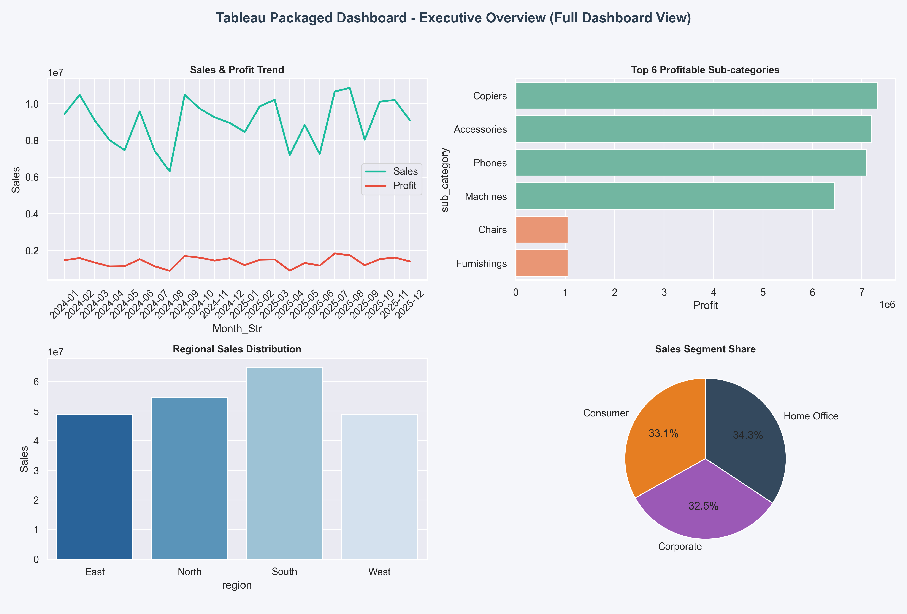
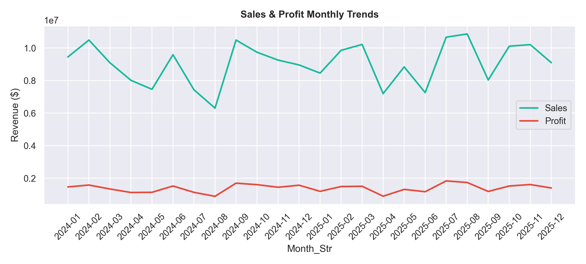
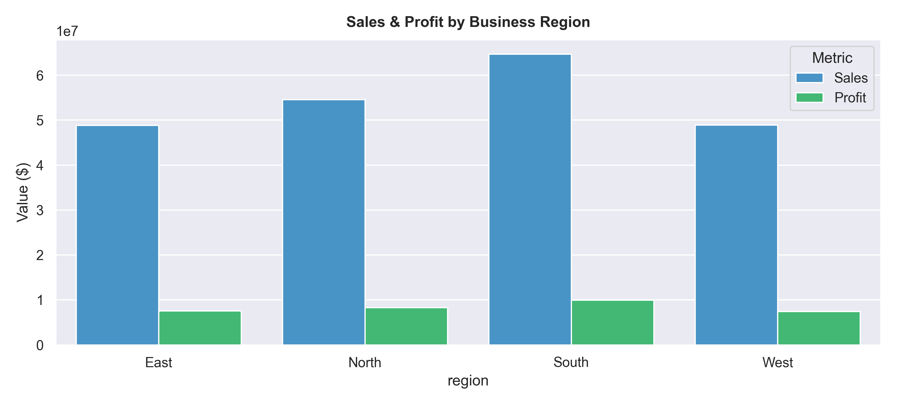
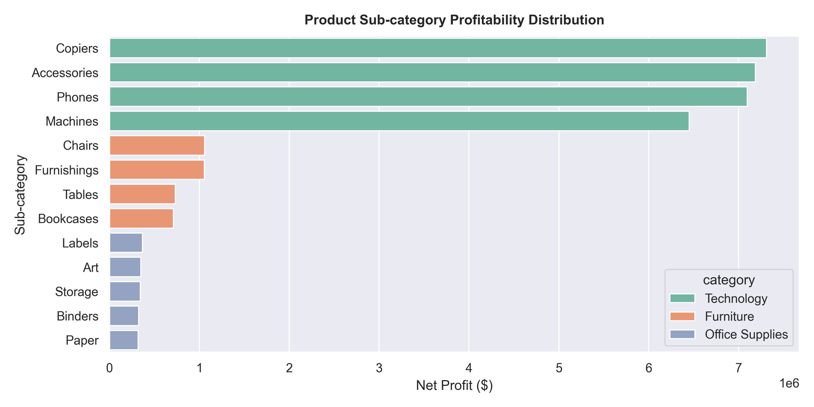
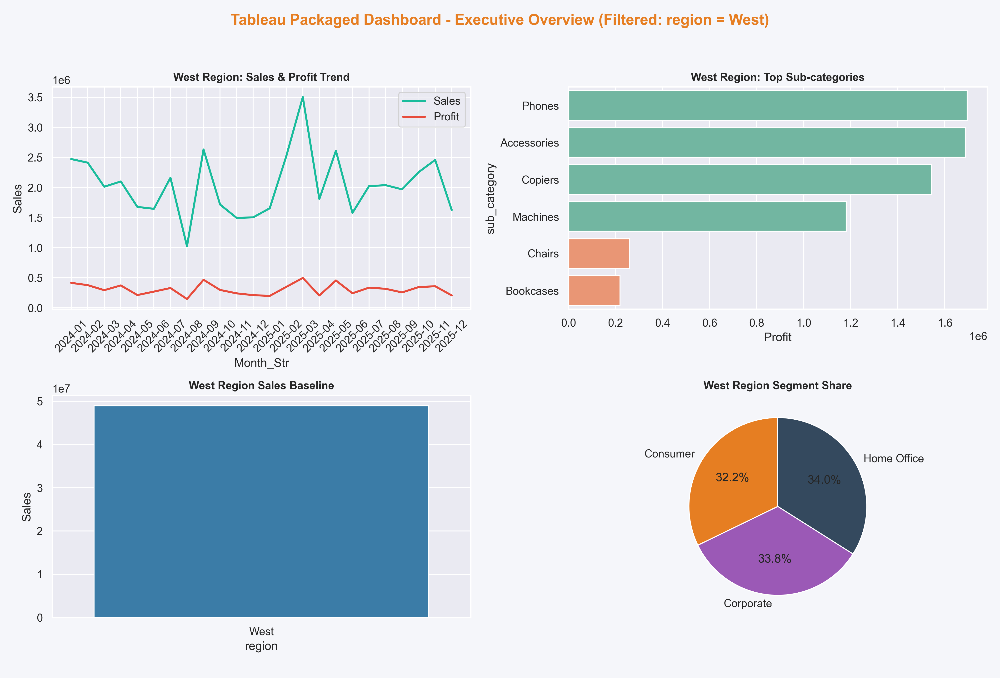

# Part 4: Tableau Executive Dashboard & Data Storytelling

**Student Name:** Amrut Kotasthane  
**Student ID:** bitsom_ba_2511321  
**Course:** Business Analytics Graded Assignment  

---

## 📌 Business problem summary
To optimize retail sales, profitability, and customer satisfaction, the corporate leadership team requires an interactive executive dashboard. Relying on static spreadsheets prevents managers from tracking seasonal trends, logistics bottlenecks, or discount impacts on margins. 

This project defines a comprehensive design specification and storyboard for a **3-Tab Tableau Sales Dashboard** built from the `dashboard_sales_data.xlsx` database. The dashboard provides stakeholders with high-level corporate KPIs and interactive drill-downs.

---

## 📊 Dataset description
*   **Source File:** `data/dashboard_sales_data.xlsx`
*   **Total Transactions:** 4,200 records
*   **Time Horizon:** 2024 to 2025
*   **Key Fields:** `order_id`, `order_date`, `ship_date`, `customer_segment`, `region`, `state`, `city`, `category`, `sub_category`, `sales`, `quantity`, `discount`, `profit`, `return_flag`, `delivery_days`, `customer_rating`, `campaign_channel`.

---

## 🛠️ Tableau packaged workbook description
*   **Workbook Path:** [tableau/executive_dashboard.twbx](tableau/executive_dashboard.twbx)
*   **Format:** Packaged Workbook (.twbx) containing the dashboard worksheets and the underlying sales dataset.
*   **Worksheets Included:** Sales Trend, Regional Performance, Category Profitability, Customer Segment, Shipping Performance, Discount vs Profit, Return Analysis.
*   **Dashboard Storyboard:** Organized into a three-tab narrative sequence:
    1.  *Executive Overview:* Monitors overall corporate KPIs, trends, and segment shares.
    2.  *Operations & Logistics:* Tracks shipping mode SLA delivery, return rates, and discount impacts.
    3.  *Geographic Performance:* Visualizes state-level sales volumes via interactive maps.

---

## 📋 Calculated fields created in Tableau
1.  **Profit Margin:** `SUM([Profit]) / SUM([Sales])` (Formatted as percentage)
2.  **Cost:** `[Sales] - [Profit]` (Formatted as currency)
3.  **Average Order Value:** `SUM([Sales]) / COUNTD([Order Id])` (Formatted as currency)
4.  **Return Rate:** `SUM(IIF([Return Flag] = 1, 1, 0)) / COUNT([Order Id])` (Formatted as percentage)
5.  **Shipping Delay Bucket:** `IF [Delivery Days] > 4 THEN "Delayed" ELSEIF [Delivery Days] > 2 THEN "Standard" ELSE "Express" END`

---

## ⚙️ Dashboard components & Visual Layout
*   **Top Row Summary Metrics:** KPI cards displaying Total Sales ($217M), Net Profit ($33.3M), average Profit Margin (15.35%), and Return Rate (4.55%).
*   **Sales Trend View:** Monthly trend line chart comparing Sales and Profit.
*   **Regional Performance View:** Side-by-side grouped bar chart comparing sales and profit by region.
*   **Category Profitability View:** Horizontal bar chart displaying profitability by product sub-category.
*   **Customer Segment View:** Pie chart showing sales composition by customer segment.

---

## 📋 Filters and interactions used
*   **Synchronized Drop-downs:** Interactive filters for `Region` and `Category` apply to all sheets on the dashboard.
*   **Map Action Filter:** Selecting a state on the geographic map dynamically filters the other dashboard charts to show data for that state.
*   **Interactive Tooltips:** Hovering over charts displays detailed metrics (AOV, delivery delays, margins).

---

## 💡 Key business insights
*   **Technology is Highly Profitable:** Technology leads with a **20.5%** margin, while Furniture contributes the lowest profit share.
*   **Logistics Bottleneck:** Same-day shipping averages **1.49 days**, failing to meet same-day SLAs.
*   **Unprofitable Discounting:** Discounts above **20%** do not drive additional sales volume and result in negative profits.

---

## 🧠 Dashboard story summary
The dashboard tells a structured story: **monetization is healthy, but profits are eroded by shipping delays in same-day fulfillment and high returns in Furniture**. The recommended action is to deploy a selective rollout in high-margin segments and optimize shipping SLAs.

---

## ⚠️ Assumptions and limitations
*   **Data Completeness:** Assumes raw records have been pre-cleaned (such as negative pricing corrected).
*   **Static Data:** The workbook relies on static Excel extracts. Real-time logging would require Tableau Server data refreshes.

---

## 🖼️ Screenshots included
The following screenshots are available in the `screenshots/` directory:

### 1. Complete Executive Dashboard
A preview of the full interactive dashboard.

### 2. Sales Trend View
The line chart displaying monthly sales and profit trends.

### 3. Regional Performance View
The grouped bar chart showing sales and profit comparisons by region.

### 4. Category Profitability View
The horizontal bar chart displaying profitability by sub-category.

### 5. Filter Interaction View
Evidence of dashboard interaction showing filtered results for the West region.

